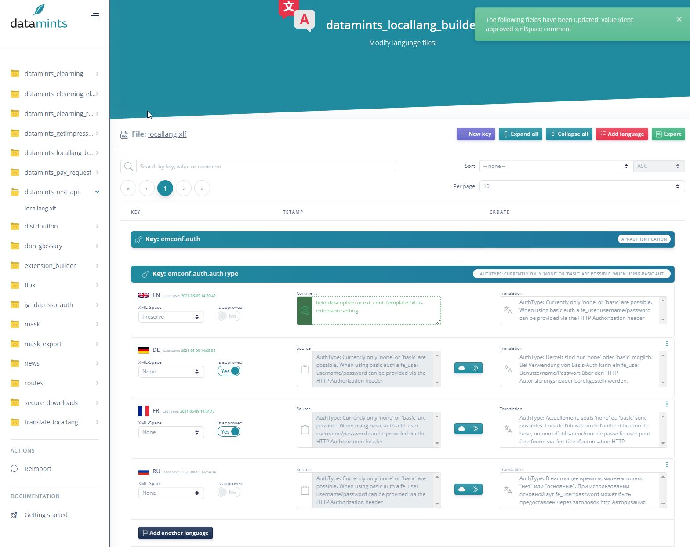

.. every .rst file should include Includes.txt
.. use correct path!

.. include:: Includes.txt

.. Every manual should have a start label for cross-referencing to
.. start page. Do not remove this!

.. _start:

=============================================================
datamints locallang builder
=============================================================

:Version:
   |release|

:Language:
   en

:Authors:
   Mark Weisgerber

:Email:
   mark.weisgerber@outlook.de / m.weisgerber@datamints.com

:License:
   Please see file LICENSE.txt

The extension "datamints_locallang_builder" offers a backend module for translating and modifying local language files of active extensions. It is also possible to use an independent translation provider such as Azure or DeepL

**TYPO3**

The content of this document is related to TYPO3 CMS,
a GNU/GPL CMS/Framework available from `typo3.org <https://typo3.org/>`_ .

**Community Documentation**

This documentation is community documentation for the TYPO3 extension datamints locallang builder

It is maintained as part of this third party extension.

If you find an error or something is missing, please:
`Report a Problem <https://github.com/datamintsGmbH/datamints_locallang_builder/issues/new>`__

**Extension Manual**

This documentation is for the TYPO3 extension datamints_locallang_builder.

**For Contributors**

You are welcome to help improve this guide.
Just click on "Edit me on GitHub" on the top right to submit your change request.

**Table of Contents**

.. toctree::
   :maxdepth: 3

   Installation/Index
   Configuration/Index
   Editor/Index
   Developer/Index
   ChangeLog/Index
